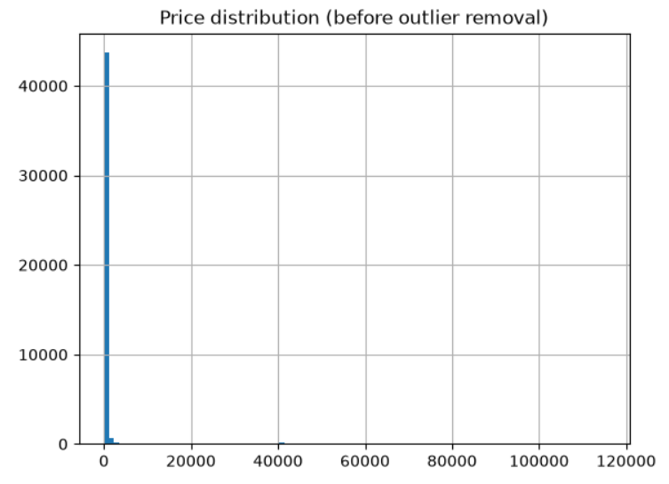
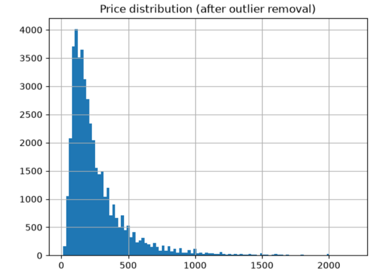
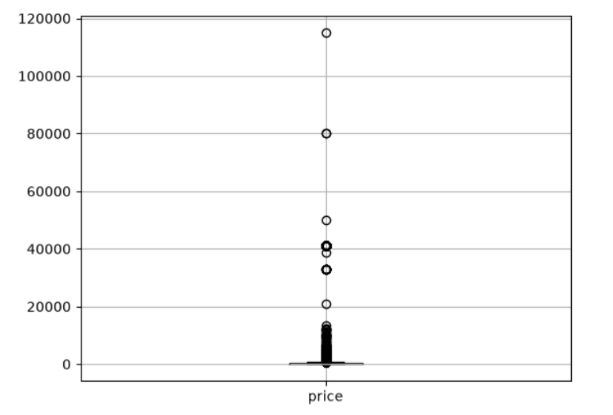
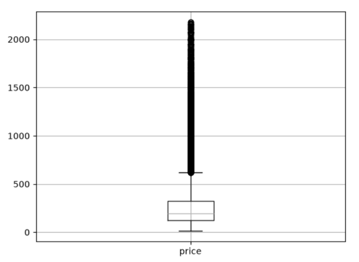
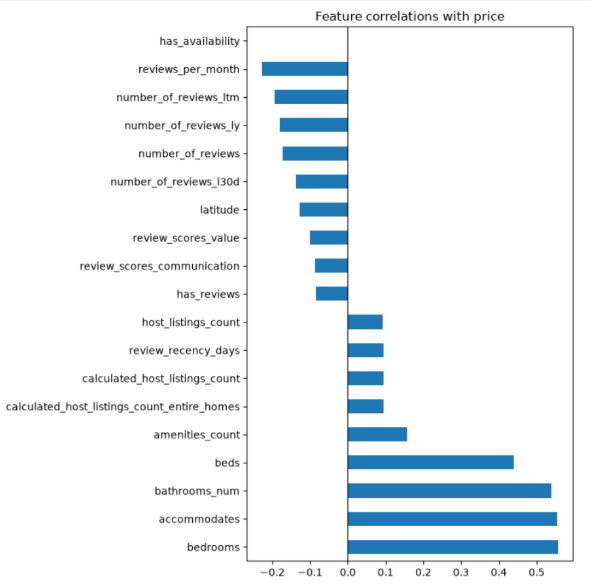
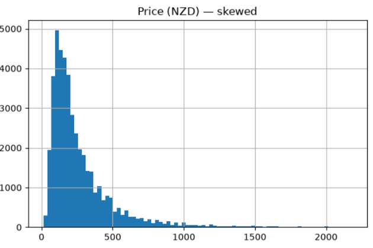
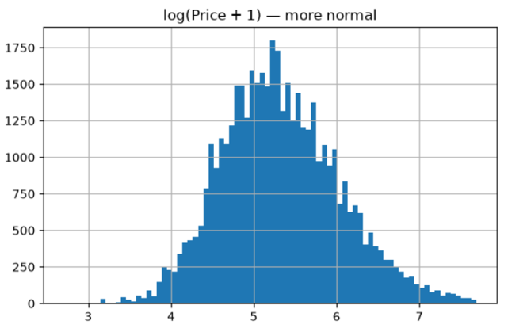
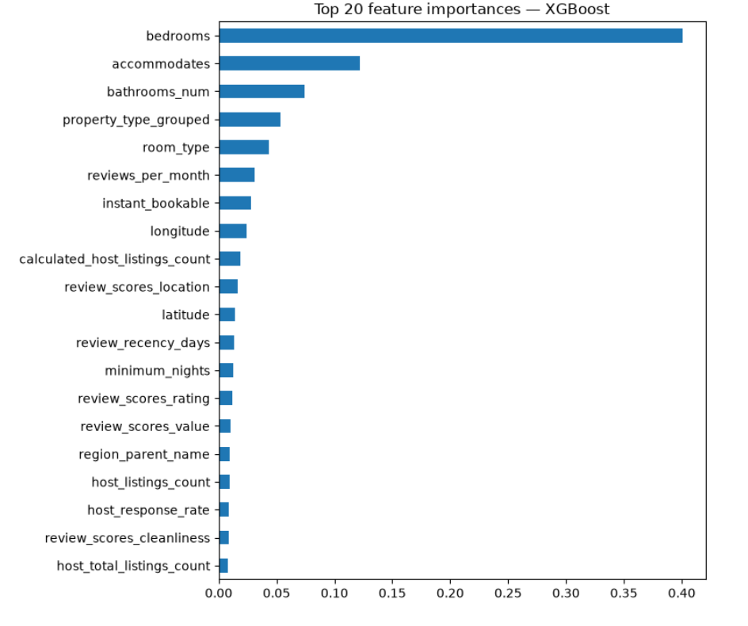
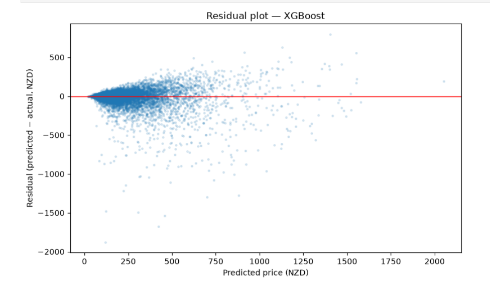
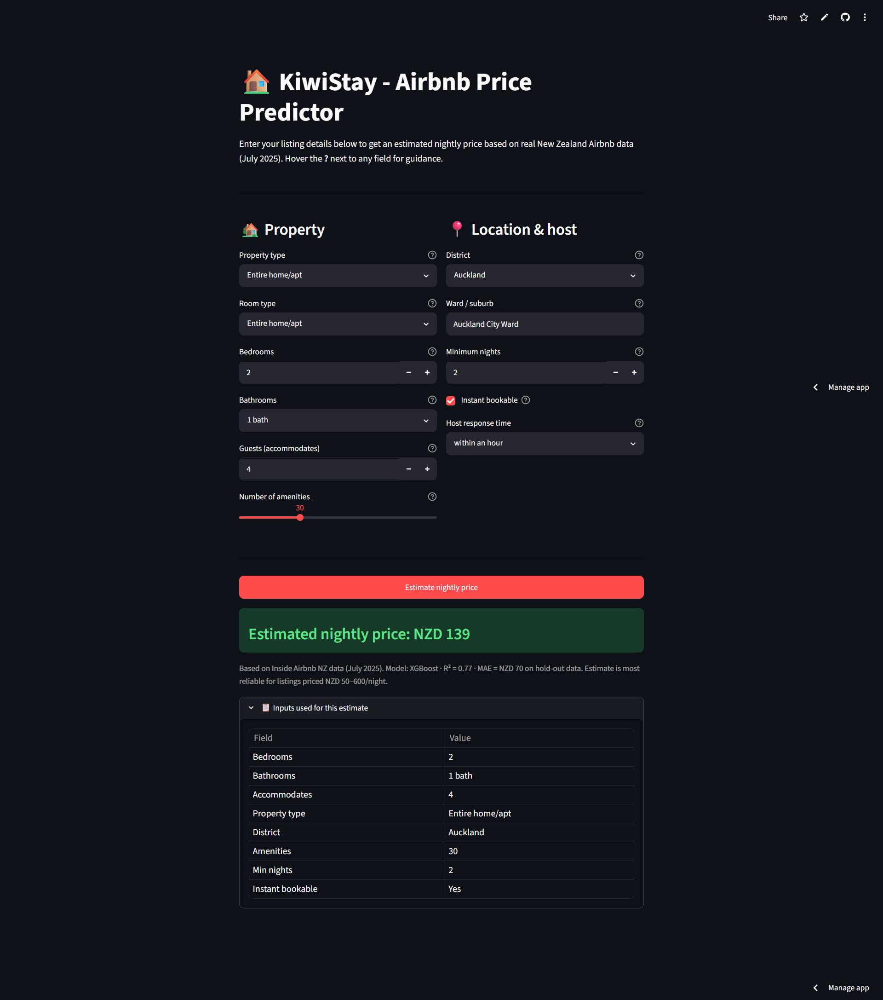

# KiwiStay Airbnb Price Predictor

KiwiStay predicts Airbnb nightly prices in New Zealand from listing attributes, location signals, and engineered review and availability features. The project includes notebook-based data quality checks, feature engineering, model training, and a deployed Streamlit demo.

**Live app:** [https://kiwistaypricepredict.streamlit.app/#kiwi-stay-airbnb-price-predictor](https://kiwistaypricepredict.streamlit.app/#kiwi-stay-airbnb-price-predictor)

## Highlights

- Trains and compares several regression models for NZD price prediction.
- Uses log-price modeling to reduce skew during training.
- Exports model diagnostics and notebook figures into `reports/figures/`.
- Deploys an interactive Streamlit app for end-to-end price prediction.

## Results

The strongest evaluated model was XGBoost.

| Model | RMSE (NZD) | MAE (NZD) | R² |
| --- | ---: | ---: | ---: |
| Ridge baseline | 171960.583 | - | - |
| LightGBM | 134710.766 | - | - |
| XGBoost | 132 | 70 | 0.773 |

XGBoost gave the best balance of error reduction and explained variance, so it is the recommended model for the deployed app.

## Notebook Outputs

### Data Quality

The data quality notebook shows how outlier removal changed the price distribution from extremely skewed to more usable for modeling.

| Before outlier removal | After outlier removal |
| --- | --- |
|  |  |
|  |  |

### Feature Engineering

`feature_engineering.ipynb` surfaced the most important linear relationships with price.



### Model Training

The model training notebook confirms why log-transforming price helps and shows which features drive the final XGBoost model.

| Price before transform | Log(price + 1) |
| --- | --- |
|  |  |





### App Preview



## Repository Layout

```text
main.py
app/
data/
	raw/
	processed/
models/
notebooks/
reports/figures/
```

## Key Workflow

1. Run the data quality notebook to inspect nulls, distributions, and outliers.
2. Engineer features and generate correlation-based diagnostics.
3. Train candidate models and compare the final metrics.
4. Launch the Streamlit app and use the saved model artifacts for prediction.

## Getting Started

### Install Dependencies

```bash
pip install -r requirements.txt
```

### Run the App

```bash
streamlit run app/app.py
```

If your Streamlit entry point is different in your environment, use the script that builds the deployed demo.

## Notes

- The price target is handled in NZD.
- The modeling workflow uses a log transform internally to reduce skew.
- The published figures in `reports/figures/` are referenced directly in this README for quick review.
